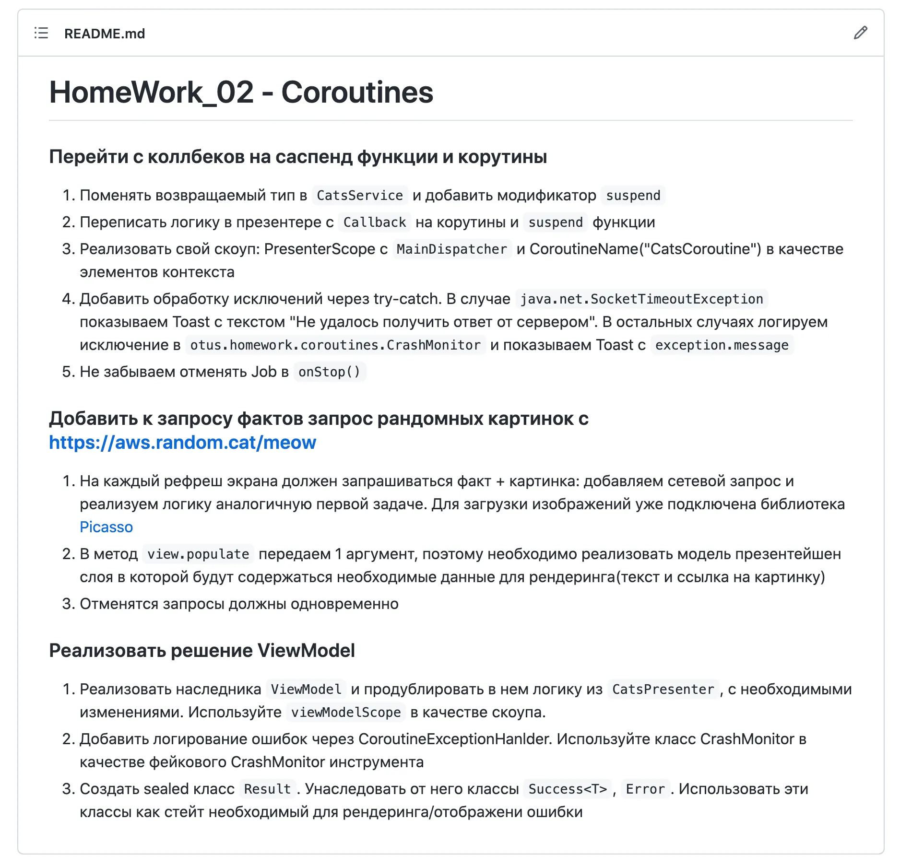
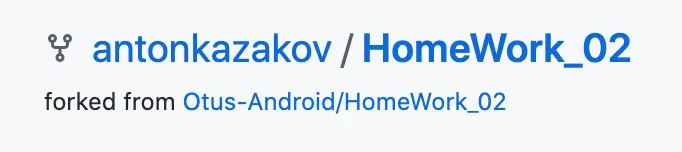
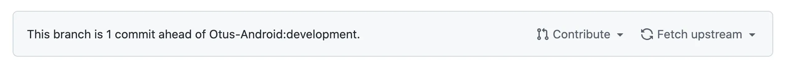
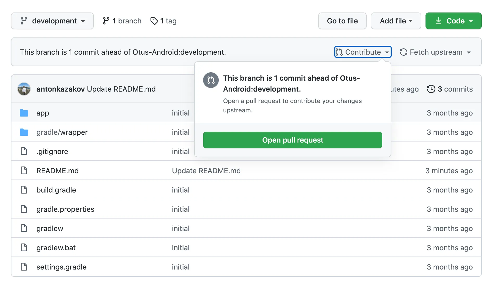
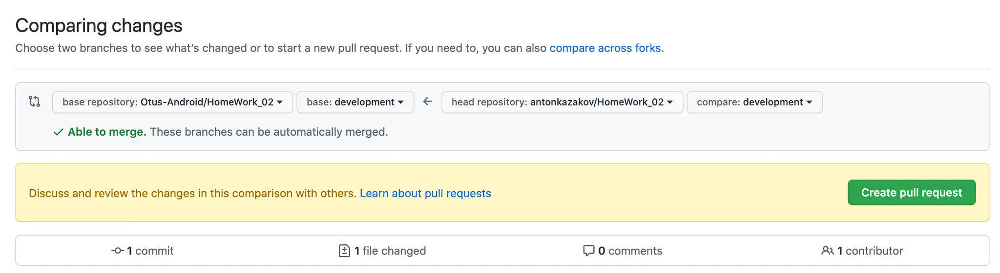
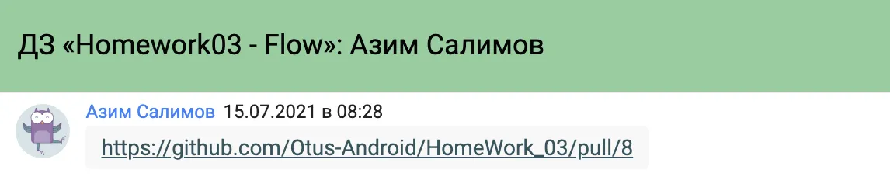
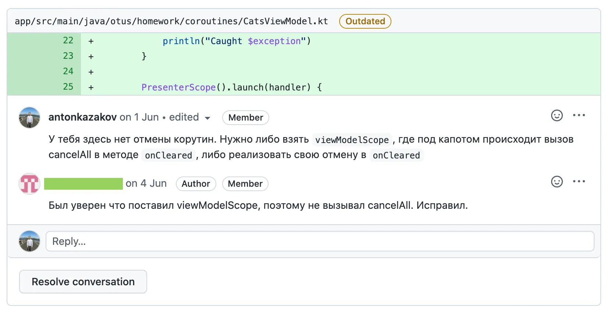

# Как сдавать домашнее задание

Давайте рассмотрим процесс сдачи домашней работы на примере ДЗ к уроку по корутинам:

1. В личном кабинете к лекциям прикреплены домашние работы. Описание домашних работ есть в личном кабинете, Github'е и Notion'е. Описания в разных источниках синхронизированы. 
    
    
    
    В описании есть вся информация необходимая для выполнения ДЗ, если есть непонятные моменты то смело пишите в чат. 
    
2. Чтобы начать выполнять домашнюю работу сделайте форк репозитория нажав кнопку **Fork** в правом верхнем углу. Репозитории с условиями задачи Read Only, поэтому пушить в них не получится.
    
    
    
3. После того как вы сделали форк репозитория, нужно склонировать его и далее работать в нем. Строгих требований к именованиям коммитов нет, но старайтесь группировать задачи в коммиты, либо делайте commit squash перед пушем.
4. После того как все задачи выполнены сделайте push в свой форк.
5. После пуша на странице вашего форка появится блок с сообщением о том что ваша development ветка опережает development ветку мастер репозитория на N коммитов.
    
    
    
6. Нажмите кнопку **Contribute**, проверьте дифф и откройте пулл-реквест
    
    
    
    
    
7. Самая сложная часть закончена. Чтобы преподаватель вовремя узнал о выполненной работе, которую нужно проверить, обязательно отправьте сообщение с ссылкой на пулл реквест в Личный Кабинет Otus.
    
    
    
8. Теперь необходимо дождаться ревью от преподавателей/менторов. Если работа выполнена отлично и никаких серьезных замечаний нет, то пулл-реквест закрывается и в личном кабинете выставляется оценка(у нас бинарная система оценки зачет/незачет). Если есть замечания которые необходимо исправить то пулл реквест возвращается с флагом Request changes и списком комментариев к коду. Дискуссии лучше вести прямо на Github, чтобы не терять контекст. **Если преподаватель/ментор не отвечает на ваш реплай, не стесняйтесь писать в личные сообщения**(возможно он просто пропустил ваш ответ).
    
    
    
9. После того как все спорные моменты решены и замечания поправлены, пулл-реквест будет закрыт и домашняя работа считается сданной
